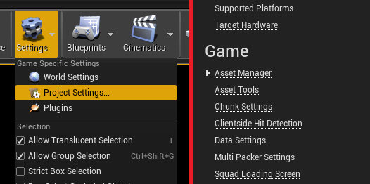
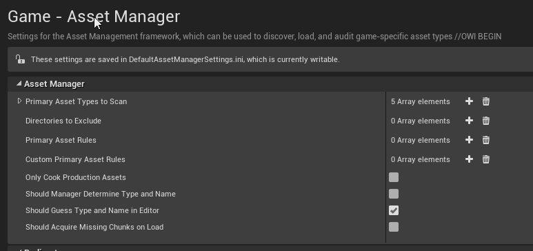

# Squad Editor Getting Started

This is a quick and simple guide to getting started making simple edits to squad. If you're looking to contribute to this repo, check out [the contributions page](/docs/readme.md).

There is also a quick guide to [copying vanilla assets or creating your own](/docs/creatingAssets.md).

### Contents

- [Squad SDK Setup](#squad-sdk-setup)
- [Asset Manager Setup](#asset-manager-setup)
- [Cooking](#cooking)

## Squad SDK Setup

- [Install SDK](#install-sdk)
- [Verify SDK files](#verify-files)
- [Clone repo](#clone-repo) into `SquadEditor/Squad/Plugins/Mods/` *(optional)*

### Install SDK

If you have the SDK installed, skip this paragraph. To get the SDK installed, you'll want to start by downloading the [Epic Games Launcher](https://www.epicgames.com/store/en-US/download) (yes, it's required). Once you have it all downloaded and you're signed in, find the [Squad Editor](https://www.epicgames.com/store/en-US/p/squad) on the Epic Games Store by clicking the provided link or searching for it on the store.

### Verify Files

Once installed, you'll need to verify your Squad SDK files through the Epic Games Launcher. This may remove mod data in the Squad SDK, so remember to save your content if you're working on something else. This doesn't take that long and will save some headache in the future

> **NOTE:** If this is your editors first launch, it might take up to 5-10 min depending on your PC, be patient. If it's taking more than 30 min, consider killing the process and relaunching.

### Clone Repo

You'll only need to do this if you're contributing to another project, and you'll want to make sure that you've launched the editor before cloning.

If you're unfamiliar with Git and don't feel like using it, you can always head over to the GitHub page and download a zip from the 'Code' button in the top right corner. Otherwise, clone this repo into the path `SquadEditor/Squad/Plugins/Mods/`


```console
AleX@yennefer MINGW64 /f/SquadEditor/Squad/Plugins/Mods
$ git clone git@github.com:alexgibbs606/UnitedFrontEvents.git
Cloning into 'UnitedFrontEvents'...
Enter passphrase for key '/c/Users/AleX/.ssh/id_rsa':
remote: Enumerating objects: 124, done.
remote: Counting objects: 100% (124/124), done.
remote: Compressing objects: 100% (81/81), done.
remote: Total 124 (delta 17), reused 121 (delta 14), pack-reused 0
Receiving objects: 100% (124/124), 6.93 MiB | 13.24 MiB/s, done.
Resolving deltas: 100% (17/17), done.

AleX@yennefer MINGW64 /f/SquadEditor/Squad/Plugins/Mods
$ ll
total 4
drwxr-xr-x 1 AleX 197121 0 Nov 26 11:07 UnitedFrontEvents/
```

## Asset Manager Setup

Now that you have the code, you'll need to link your assets before you build as we don't track that information in the repository. Open up the project settings, then "Asset Manager" on the left side under "Game".



In each array element, you'll edit the 'Directories' element to point as the same directory that the CAF DLC is pointing at. In this example, I'm doing it for the `UnitedFrontEvents` mod.



***Note:** Element 0 should not be edited*

Continue with these changes, elements 1 and 2 should point to the maps directory, elements 3 and 4 should point to the Settings directory.

## Cooking

Only continue to this step once you're finished with your development or alterations.

Many of these steps are repeated to prevent UE4 from erroring out and/or causing issues.

1. Save your work and close the editor
2. Delete folders and all of their contents:
```
  ./SquadEditor/Squad/DerivedDataCache/
  ./SquadEditor/Squad/Intermediate/
  ./SquadEditor/Squad/ModSDK/
  ./SquadEditor/Squad/Saved/
  ./SquadEditor/Squad/Plugins/Mods/UnitedFrontEvents/Saved/
```
3. Open Squad Editor
4. Right click mod content folder, then fix-up and validate files  

5. Load mod from the modding panel, and package the mod.
6. Once you get the success message, you can publish and test it
